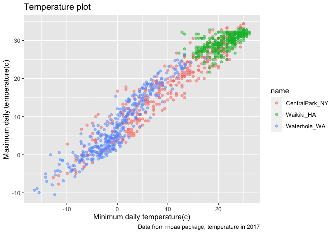
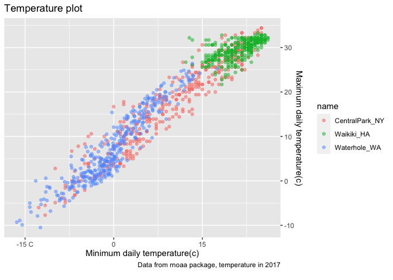
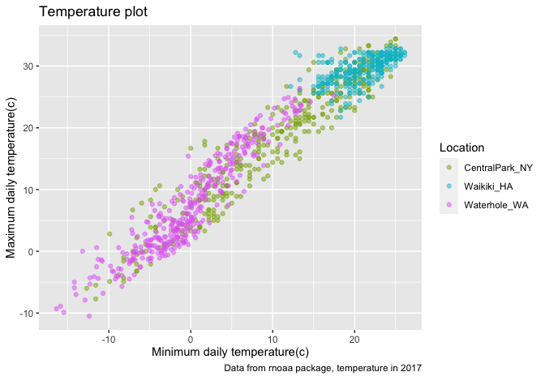
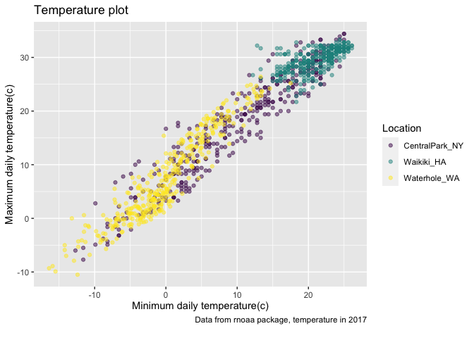
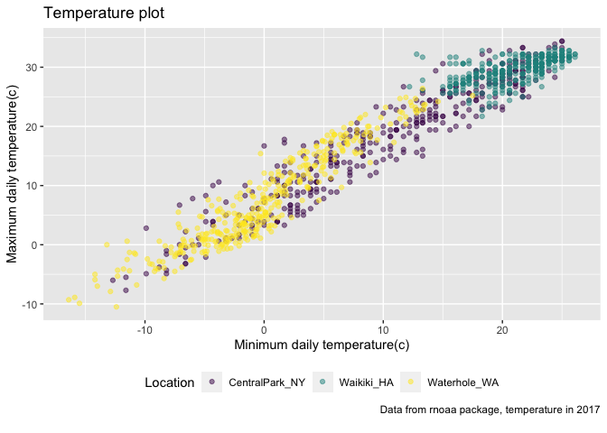
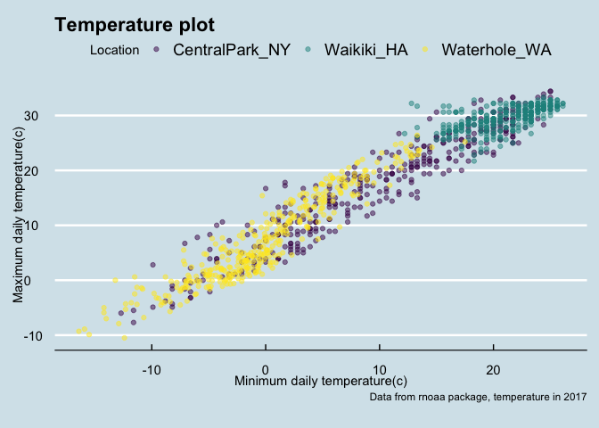
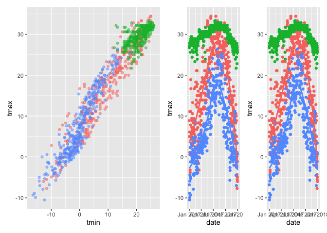

viz\_i
================
3/14/2022

``` r
library(tidyverse)
```

    ## ── Attaching packages ─────────────────────────────────────── tidyverse 1.3.1 ──

    ## ✓ ggplot2 3.3.5     ✓ purrr   0.3.4
    ## ✓ tibble  3.1.5     ✓ dplyr   1.0.7
    ## ✓ tidyr   1.1.4     ✓ stringr 1.4.0
    ## ✓ readr   2.0.2     ✓ forcats 0.5.1

    ## ── Conflicts ────────────────────────────────────────── tidyverse_conflicts() ──
    ## x dplyr::filter() masks stats::filter()
    ## x dplyr::lag()    masks stats::lag()

``` r
library(patchwork)
```

## Load the weather data

``` r
weather_df = 
  rnoaa::meteo_pull_monitors(
    c("USW00094728", "USC00519397", "USS0023B17S"),
    var = c("PRCP", "TMIN", "TMAX"), 
    date_min = "2017-01-01",
    date_max = "2017-12-31") %>%
  mutate(
    name = recode(
      id, 
      USW00094728 = "CentralPark_NY", 
      USC00519397 = "Waikiki_HA",
      USS0023B17S = "Waterhole_WA"),
    tmin = tmin / 10,
    tmax = tmax / 10) %>%
  select(name, id, everything())
```

    ## Registered S3 method overwritten by 'hoardr':
    ##   method           from
    ##   print.cache_info httr

    ## using cached file: ~/Library/Caches/R/noaa_ghcnd/USW00094728.dly

    ## date created (size, mb): 2022-03-09 20:42:29 (7.641)

    ## file min/max dates: 1869-01-01 / 2022-03-31

    ## using cached file: ~/Library/Caches/R/noaa_ghcnd/USC00519397.dly

    ## date created (size, mb): 2022-03-09 20:42:39 (1.697)

    ## file min/max dates: 1965-01-01 / 2020-02-29

    ## using cached file: ~/Library/Caches/R/noaa_ghcnd/USS0023B17S.dly

    ## date created (size, mb): 2022-03-09 20:42:43 (0.93)

    ## file min/max dates: 1999-09-01 / 2022-03-31

``` r
weather_df
```

    ## # A tibble: 1,095 × 6
    ##    name           id          date        prcp  tmax  tmin
    ##    <chr>          <chr>       <date>     <dbl> <dbl> <dbl>
    ##  1 CentralPark_NY USW00094728 2017-01-01     0   8.9   4.4
    ##  2 CentralPark_NY USW00094728 2017-01-02    53   5     2.8
    ##  3 CentralPark_NY USW00094728 2017-01-03   147   6.1   3.9
    ##  4 CentralPark_NY USW00094728 2017-01-04     0  11.1   1.1
    ##  5 CentralPark_NY USW00094728 2017-01-05     0   1.1  -2.7
    ##  6 CentralPark_NY USW00094728 2017-01-06    13   0.6  -3.8
    ##  7 CentralPark_NY USW00094728 2017-01-07    81  -3.2  -6.6
    ##  8 CentralPark_NY USW00094728 2017-01-08     0  -3.8  -8.8
    ##  9 CentralPark_NY USW00094728 2017-01-09     0  -4.9  -9.9
    ## 10 CentralPark_NY USW00094728 2017-01-10     0   7.8  -6  
    ## # … with 1,085 more rows

## Remember this plot

``` r
weather_df %>% 
  ggplot(aes(x = tmin, y = tmax, color = name)) +
  geom_point(alpha = .5)
```

    ## Warning: Removed 15 rows containing missing values (geom_point).

<!-- -->

# Labels

``` r
weather_df %>% 
  ggplot(aes(x = tmin, y = tmax, color = name)) +
  geom_point(alpha = .5) +
  labs(
    title = "Temperature plot",
    x = "Minimum daily temperature(c)", 
    y = "Maximum daily temperature(c)",
    caption = "Data from rnoaa package, temperature in 2017
    "
  )
```

    ## Warning: Removed 15 rows containing missing values (geom_point).

<!-- -->

## Scales

Start with the same plot

``` r
weather_df %>% 
  ggplot(aes(x = tmin, y = tmax, color = name)) +
  geom_point(alpha = .5) +
  labs(
    title = "Temperature plot",
    x = "Minimum daily temperature(c)", 
    y = "Maximum daily temperature(c)",
    caption = "Data from rnoaa package, temperature in 2017
    "
  ) +
  scale_x_continuous(
    breaks = c(-15, 0, 15), 
    labels = c("-15 C", "0" , "15")
  ) +
  scale_y_continuous(
    position = "right"
  )
```

    ## Warning: Removed 15 rows containing missing values (geom_point).

<!-- -->

Look at color scales

``` r
weather_df %>% 
  ggplot(aes(x = tmin, y = tmax, color = name)) +
  geom_point(alpha = .5) +
  labs(
    title = "Temperature plot",
    x = "Minimum daily temperature(c)", 
    y = "Maximum daily temperature(c)",
    caption = "Data from rnoaa package, temperature in 2017
    "
  ) +
  scale_color_hue(
    name = "Location",
    h = c(100, 300)
  )
```

    ## Warning: Removed 15 rows containing missing values (geom_point).

<!-- -->

``` r
weather_df %>% 
  ggplot(aes(x = tmin, y = tmax, color = name)) +
  geom_point(alpha = .5) +
  labs(
    title = "Temperature plot",
    x = "Minimum daily temperature(c)", 
    y = "Maximum daily temperature(c)",
    caption = "Data from rnoaa package, temperature in 2017
    "
  ) +
  viridis::scale_color_viridis(
    name = "Location",
    discrete = TRUE)
```

    ## Warning: Removed 15 rows containing missing values (geom_point).

<!-- -->

## Themes

``` r
weather_df %>% 
  ggplot(aes(x = tmin, y = tmax, color = name)) +
  geom_point(alpha = .5) +
  labs(
    title = "Temperature plot",
    x = "Minimum daily temperature(c)", 
    y = "Maximum daily temperature(c)",
    caption = "Data from rnoaa package, temperature in 2017
    "
  ) +
  viridis::scale_color_viridis(
    name = "Location",
    discrete = TRUE) +
  theme(legend.position = "bottom")
```

    ## Warning: Removed 15 rows containing missing values (geom_point).

<!-- -->

``` r
weather_df %>% 
  ggplot(aes(x = tmin, y = tmax, color = name)) +
  geom_point(alpha = .5) +
  labs(
    title = "Temperature plot",
    x = "Minimum daily temperature(c)", 
    y = "Maximum daily temperature(c)",
    caption = "Data from rnoaa package, temperature in 2017
    "
  ) +
  viridis::scale_color_viridis(
    name = "Location",
    discrete = TRUE) +
  ggthemes::theme_economist()
```

    ## Warning: Removed 15 rows containing missing values (geom_point).

<!-- -->

## Setting options

``` r
library(tidyverse)

kniter::opts_chunk$set(
  fig.width = 6,
  fig.asp = .6,
  out.width = "90"
)

theme_set(theme. minimal() + theme(lengend. position = "bottom"))

options(
   ggplot2.continuous.colour = "viridis" ,
   ggplot2.continuous. fill = "viridis"
)

scale_colour_discrete = scale_color_vifidis_d
scale_fill_discrete = scale_fill_viridis_d
```

## Data args in `geom`

``` r
central_park = 
  weather_df %>% 
  filter(name == "CentralPark_NY")

waikiki =
  weather_df %>% 
  filter(name == "Waikiki_HA")

ggplot(data = waikiki, aes(x = date, y = tmax, color = name)) +
  geom_point() +
  geom_line(data = central_park)
```

    ## Warning: Removed 3 rows containing missing values (geom_point).

<!-- -->

## patchwork

Remember faceting

``` r
weather_df %>% 
  ggplot(aes(x = tmin, fill = name)) +
  geom_density(alpha = .5) +
  facet_grid(. ~name)
```

    ## Warning: Removed 15 rows containing non-finite values (stat_density).

<!-- -->

what happens when you want to multipanel plots but can’t facet?

``` r
tmax_tmin_p=
  weather_df %>% 
  ggplot(aes(x = tmin, y = tmax, color = name)) +
  geom_point(alpha = .5) +
  theme(legend.position = "none")

precp_dens_p=
  weather_df %>% 
  ggplot(aes(x = date, y = tmax, color = name)) +
  geom_point() +
  geom_smooth(se = FALSE) +
  theme(legend.position = "none")

tmax_date_p=
  weather_df %>% 
  ggplot(aes(x = date, y = tmax, color = name)) +
  geom_point() +
  geom_smooth(se = FALSE) +
  theme(legend.position = "none")

tmax_tmin_p + (precp_dens_p + tmax_date_p)
```

    ## Warning: Removed 15 rows containing missing values (geom_point).

    ## `geom_smooth()` using method = 'loess' and formula 'y ~ x'

    ## Warning: Removed 3 rows containing non-finite values (stat_smooth).

    ## Warning: Removed 3 rows containing missing values (geom_point).

    ## `geom_smooth()` using method = 'loess' and formula 'y ~ x'

    ## Warning: Removed 3 rows containing non-finite values (stat_smooth).
    
    ## Warning: Removed 3 rows containing missing values (geom_point).

<!-- -->

\#\#Data manipulation

Control your factors.

``` r
weather_df %>% 
  mutate(
    name = factor(name),
    name = forcats::fct_relevel(name, c("Wakiki_HA"))
) %>% 
  ggplot(aes(x = name, y = tmax, fill = name)) +
  geom_violin(alpha = .5)
```

    ## Warning: Unknown levels in `f`: Wakiki_HA

    ## Warning: Removed 3 rows containing non-finite values (stat_ydensity).

<!-- -->

What if i wanted densitites for tmin and tmax simultaneously?

``` r
weather_df %>% 
  filter(name == "CentralPark_NY") %>% 
  pivot_longer(
    tmax:tmin,
    names_to = "observation", 
    values_to = "temperatures"
  ) %>% 
  ggplot(aes(x = temperatures, fill = observation)) +
  geom_density(alpha = .5)
```

<!-- -->
